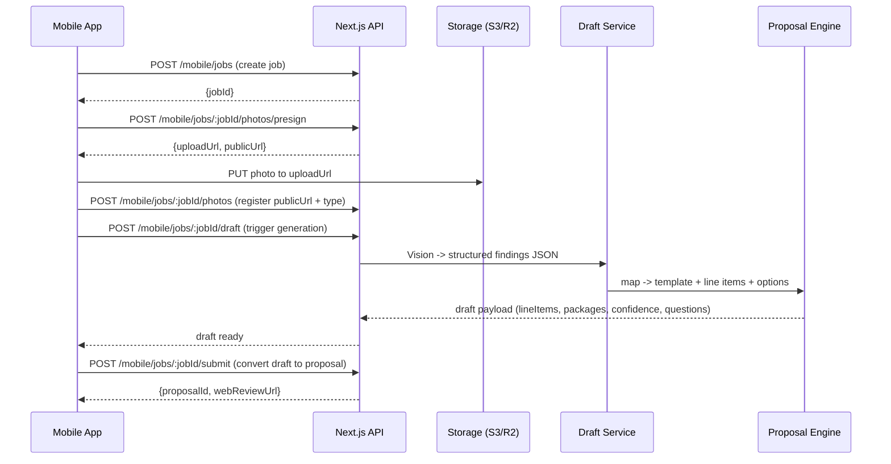

## Instant Proposal Companion App (Mobile)

This repo includes a **mobile-first “instant proposal” pipeline** backed by Next.js App Router endpoints under `/app/api/mobile/*` and Postgres tables in `shared/schema.ts` (works great with **Supabase Postgres**).

### 1) Mermaid diagrams (from the scope)

```mermaid
flowchart LR
  A[Companion Mobile App\n(Expo/React Native)] -->|Auth + API calls| B[Next.js API\n/app/api/mobile/*]
  A -->|Direct upload via presigned URL| C[Object Storage\nS3/R2/Supabase Storage]
  B --> D[(DB\nJobs/Photos/Drafts)]
  B --> E[AI Draft Service\nVision -> JSON -> Scope]
  E --> F[Pricing Engine\nYour existing pricebook + rules]
  F --> G[Proposal Engine\nYour existing Next.js proposal system]
  B -->|Return draft + link| A
  A -->|Open final review| H[Next.js Web UI\n/proposals/:id]
```



### 2) File map

Backend (Next.js repo):
- `docs/instant-proposal-companion.md`
- `src/lib/mobile/types.ts`
- `src/lib/mobile/auth.ts`
- `src/lib/mobile/storage/s3.ts`
- `src/lib/mobile/draft/pipeline.ts`
- `src/lib/mobile/draft/pricebook.ts`
- `app/api/mobile/jobs/route.ts`
- `app/api/mobile/jobs/[jobId]/photos/presign/route.ts`
- `app/api/mobile/jobs/[jobId]/photos/route.ts`
- `app/api/mobile/jobs/[jobId]/draft/route.ts` (POST + GET)
- `app/api/mobile/jobs/[jobId]/submit/route.ts`
- `shared/schema.ts` (Drizzle tables; Supabase Postgres compatible)

Mobile (Expo companion app):
- `apps/mobile/app.json`
- `apps/mobile/package.json`
- `apps/mobile/src/lib/api.ts`
- `apps/mobile/src/screens/CreateJob.tsx`
- `apps/mobile/src/screens/CapturePhotos.tsx`
- `apps/mobile/src/screens/DraftPreview.tsx`
- `apps/mobile/App.tsx`

### 3) API endpoint spec (request/response JSON)

#### Common headers
- `Idempotency-Key: <string>` (recommended for create/draft/submit)
- `x-request-id: <string>` (optional; server responds with `x-request-id` on success/error)
- Auth (see below): `x-mobile-user-id`, optional `x-mobile-api-key`

#### Create job
`POST /api/mobile/jobs`

Request:
```json
{ "jobType": "demo", "customer": "Jane Doe", "address": "123 Main St" }
```

Response:
```json
{ "jobId": 123 }
```

#### Presign upload
`POST /api/mobile/jobs/:jobId/photos/presign`

Request:
```json
{ "filename": "photo.jpg", "contentType": "image/jpeg" }
```

Response:
```json
{ "uploadUrl": "https://...", "publicUrl": "https://..." }
```

#### Register uploaded photo
`POST /api/mobile/jobs/:jobId/photos`

Request:
```json
{ "url": "https://public.cdn/.../photo.jpg", "kind": "site" }
```

Response:
```json
{ "photoId": 456 }
```

#### Generate draft
`POST /api/mobile/jobs/:jobId/draft`

Response:
```json
{ "status": "DRAFTING" }
```
or
```json
{ "status": "READY" }
```

#### Get draft (poll)
`GET /api/mobile/jobs/:jobId/draft`

Response:
```json
{
  "status": "READY",
  "payload": {
    "packages": {
      "GOOD": { "label": "Good", "lineItems": [] },
      "BETTER": { "label": "Better", "lineItems": [] },
      "BEST": { "label": "Best", "lineItems": [] }
    },
    "defaultPackage": "BETTER",
    "confidence": 70,
    "questions": [],
    "pricing": { "pricebookVersion": "v1", "inputs": {} }
  }
}
```

#### Submit to proposal system
`POST /api/mobile/jobs/:jobId/submit`

Request:
```json
{ "package": "BETTER" }
```

Response:
```json
{ "proposalId": 789, "webReviewUrl": "https://yourdomain.com/proposals/789" }
```

### 4) DB schema (Prisma-style reference) + Supabase note

This repo **does not use Prisma** (it uses **Drizzle**), but if you wanted an equivalent Prisma model set for a Supabase Postgres DB, it would look like:

```prisma
model MobileJob {
  id         Int      @id @default(autoincrement())
  userId     String
  clientName String
  address    String
  tradeId    String
  tradeName  String?
  jobTypeId  String
  jobTypeName String
  jobSize    Int      @default(2)
  jobNotes   String?
  status     String   @default("created")
  createdAt  DateTime @default(now())
  updatedAt  DateTime @updatedAt
  photos     MobileJobPhoto[]
  drafts     MobileJobDraft[]
}

model MobileJobPhoto {
  id        Int      @id @default(autoincrement())
  jobId     Int
  kind      String   @default("site")
  publicUrl String
  createdAt DateTime @default(now())
  job       MobileJob @relation(fields: [jobId], references: [id], onDelete: Cascade)
}

model MobileJobDraft {
  id         Int      @id @default(autoincrement())
  jobId      Int
  status     String   @default("pending")
  payload    Json?
  confidence Int?
  questions  String[]
  error      String?
  proposalId Int?
  createdAt  DateTime @default(now())
  updatedAt  DateTime @updatedAt
  job        MobileJob @relation(fields: [jobId], references: [id], onDelete: Cascade)
}
```

In this repo, the authoritative schema is in `shared/schema.ts` (Drizzle) and is already compatible with Supabase Postgres.

### 5) Environment variables (storage + auth)

Auth:
- `MOBILE_API_AUTH=clerk|none`
- `MOBILE_API_KEY=...` (optional, enables `x-mobile-api-key` checks)
- `NEXT_PUBLIC_WEB_BASE_URL=https://yourdomain.com` (used to build `webReviewUrl`)

Storage (S3/R2/Supabase Storage gateway):
- `S3_REGION=...` (or `auto`)
- `S3_BUCKET=scopegen25`
- `S3_ACCESS_KEY_ID=...`
- `S3_SECRET_ACCESS_KEY=...`
- `S3_ENDPOINT=...` (optional; for R2/S3-compatible endpoints)
- `S3_PUBLIC_BASE_URL=https://scopegen25.s3.amazonaws.com` (how mobile reads the uploaded file)
- `S3_FORCE_PATH_STYLE=true|false` (optional)

Vision (AWS Rekognition + GPT vision):
- `AWS_REGION=us-east-1` (or your region)
- `AWS_ACCESS_KEY_ID=...` (optional if running on AWS with IAM role)
- `AWS_SECRET_ACCESS_KEY=...` (optional if running on AWS with IAM role)
- `OPENAI_API_KEY=...`
- `OPENAI_VISION_MODEL=gpt-4o-mini` (or `gpt-4o` for max quality)

Pricing snapshot:
- `PRICEBOOK_VERSION=v1` (saved into draft payload + DB for auditability)

1build (market pricing enrichment; non-blocking, cached):
- `ONEBUILD_EXTERNAL_KEY=...`

Behavior:
- Draft generation will try to fetch cached 1build trade pricing for the job’s ZIP with a short timeout (~1.2s).
- If available, it applies a **conservative market multiplier** (clamped) and boosts confidence slightly.
- Results are cached in Postgres table `onebuild_price_cache` for ~7 days and recorded in the draft pricing snapshot.

### 6) Local testing with curl

Create a job:
```bash
curl -sS -X POST \"http://localhost:3000/api/mobile/jobs\" \\
  -H \"Content-Type: application/json\" \\
  -H \"x-mobile-user-id: <USER_ID>\" \\
  -d '{\"jobType\":\"demo\",\"customer\":\"Jane Doe\",\"address\":\"123 Main St\"}'
```

Presign upload:
```bash
curl -sS -X POST \"http://localhost:3000/api/mobile/jobs/<JOB_ID>/photos/presign\" \\
  -H \"Content-Type: application/json\" \\
  -H \"x-mobile-user-id: <USER_ID>\" \\
  -d '{\"filename\":\"photo.jpg\",\"contentType\":\"image/jpeg\"}'
```

Register photo:
```bash
curl -sS -X POST \"http://localhost:3000/api/mobile/jobs/<JOB_ID>/photos\" \\
  -H \"Content-Type: application/json\" \\
  -H \"x-mobile-user-id: <USER_ID>\" \\
  -d '{\"url\":\"https://public.cdn/.../photo.jpg\",\"kind\":\"site\"}'
```

Trigger draft:
```bash
curl -sS -X POST \"http://localhost:3000/api/mobile/jobs/<JOB_ID>/draft\" \\
  -H \"x-mobile-user-id: <USER_ID>\"
```

Poll draft:
```bash
curl -sS -X GET \"http://localhost:3000/api/mobile/jobs/<JOB_ID>/draft\" \\
  -H \"x-mobile-user-id: <USER_ID>\"
```

Submit:
```bash
curl -sS -X POST \"http://localhost:3000/api/mobile/jobs/<JOB_ID>/submit\" \\
  -H \"Content-Type: application/json\" \\
  -H \"x-mobile-user-id: <USER_ID>\" \\
  -d '{\"package\":\"BETTER\"}'
```

### Notes on async drafts (current implementation)
`POST /draft` **enqueues** a DB row (`mobile_job_drafts.status=pending`) and returns immediately. A best-effort in-process worker (`src/lib/mobile/draft/worker.ts`) picks up queued drafts with locking + retry/backoff and writes the READY payload. For true serverless reliability, replace this with a dedicated worker (Supabase Edge Function/cron/queue consumer) that calls the same pipeline.

### Error shape (structured)
Errors return:
```json
{ \"error\": { \"code\": \"INVALID_INPUT\", \"message\": \"...\", \"requestId\": \"...\" } }
```

### Vision structure (per photo)
Each `mobile_job_photos` row stores `findings` JSON with this structure:
- `detector`: AWS Rekognition labels (fast, consistent)
- `llm`: GPT vision extraction (materials/damage/missing shots)
- `combined`: a conservative combined confidence + `needsMorePhotos`

This allows the UI to show a checklist like “Need under-sink plumbing close-up” *before* generating the draft, reducing change orders.
